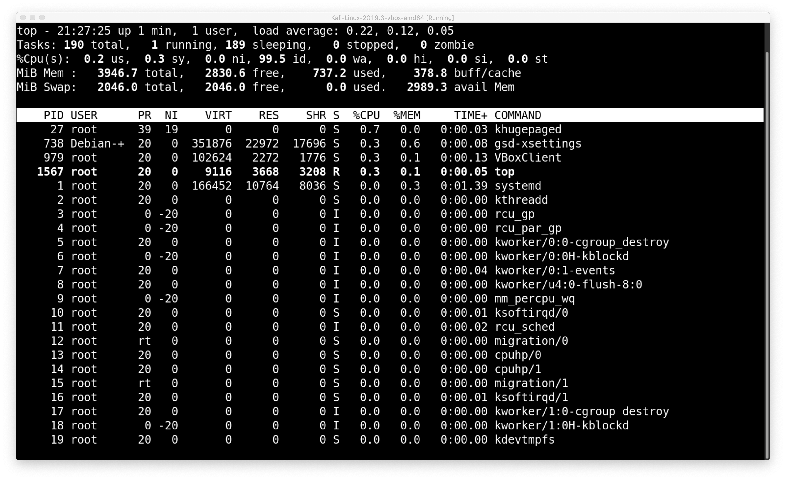

## Linux Process States

Linux has four process states, they are:
* Running/Runnable
* Sleeping
* Stopped
* Zombie

Here is an example of what these processes look like:

A _running state_ means the process is currently active and is performing operations using systems CPU. A _runnable state_ means the process is ready to run and is waiting to use the CPU. Both of these are represented with the letter `R` under processes state column `S` in Linux.

A _sleeping state_ means the process is waiting for resources that it does not have to run. Since it can not run, its access to the CPU is freed to make way for other processes. Once it receives the resources, the Linux scheduler will put it in a runnable state.

Sleeping states are further broken down into two groups, interruptible and uninterruptible.

_Interruptible sleep state_ processes will wait for an event or time slot trigger to occur before it changes state. These processes are represented with the letter `S` in the state column.
_Uninterruptible sleep state_ processes will wait for resources to arrive or a time-out trigger before it changes state. These processes are represented with the letter `D`.

Newer versions of Linux following 4.15.12 introduces the _Idle State_ which represents both interruptible and uninterruptible sleeping states. These processes are represented with the letter `I`.

A _stopped state_ means the process has exited or is terminated. Stopped processes release their resources but are kept in the process table until its parent process closes it.

A _zombie state_ means the process has stopped but it’s parent process did not close it. This is usually caused by the parent process either terminating before it’s child processes or bugs within the parent process itself. These processes are represented with the letter ‘Z’ and can not be killed normally.
