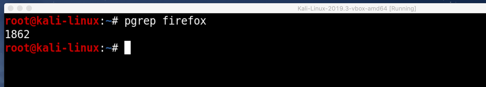

## Searching Specific Processes
{: .fs-6 .fw-300 }

A more useful command to search for the process id `PID` of a specific process is `pgrep`.
If you use `pgrep firefox` it will return a list of all processes with the `firefox` keyword.
> *`pgrep firefox`*  >-->  **[Enter]**

