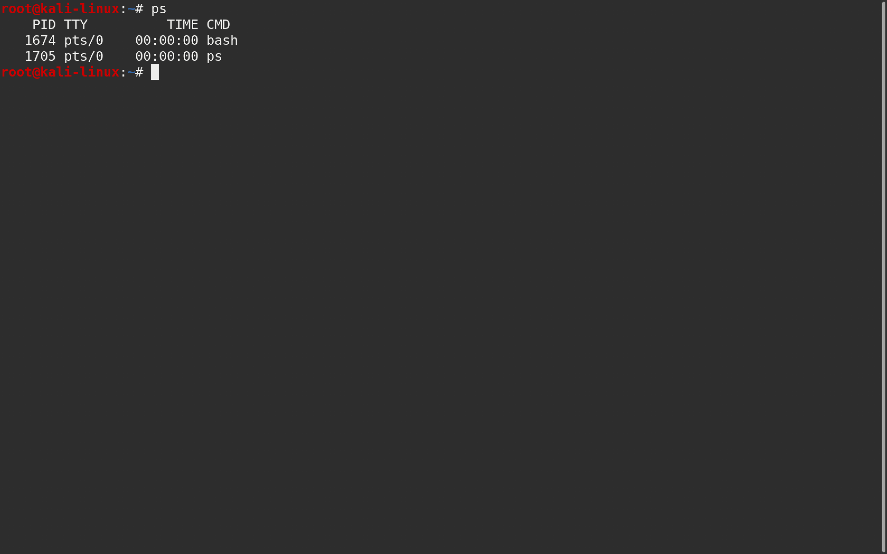
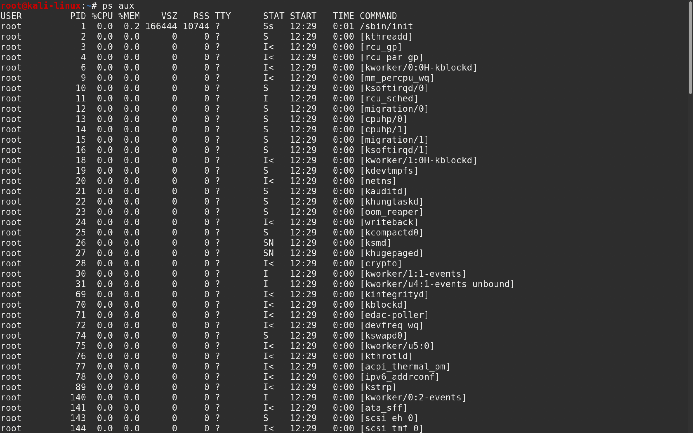
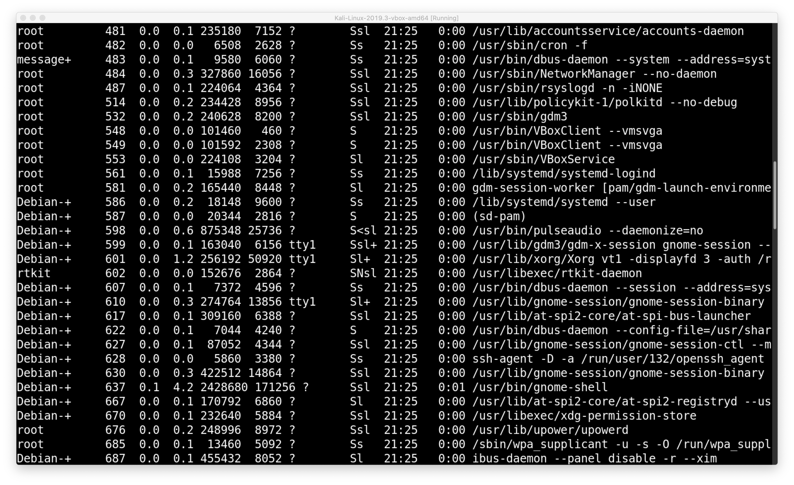
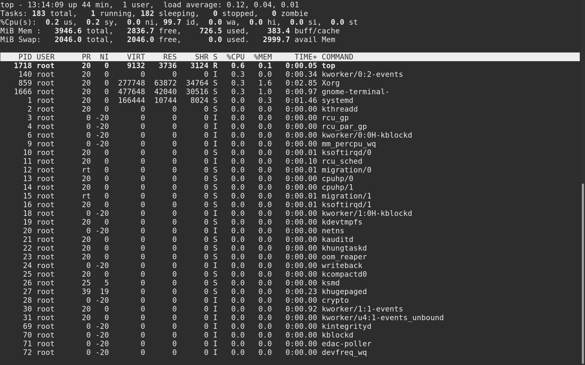

## How to View Processes
{: .fs-6 .fw-300 }

The two most common commands used to view processes are the `ps` and the `top` command. The difference between the two is `ps` takes a snapshot while `top` continuously updates its list of processes.

The `ps` stands for process status and it takes several different types of _switches_ as we can see here in the `ps` man page.

If you open a terminal and execute the `ps` command you will only see processes running on the current terminal.
> *`ps`*  >-->  **[Enter]**

If you want to check all the processes running on the machine run:
> *`ps aux`*  >-->  **[Enter]**

There is a lot more information given, we can see the different _users_, _process id_ `PID`, _state_ `STAT`, when the processes started, and the _root directory_ or _alias_ where the processes loaded from.

Try playing around with the different _switches_ and see how it affects the output of `ps`.

Lets try the top command.
> *`top`*  >-->  **[Enter]**

This gives us a lot more info but it constantly changes so it's sometimes hard to find or keep track of a process. There are switches for additional options which you can find in the `top` _man pages_. To exit press `q`.